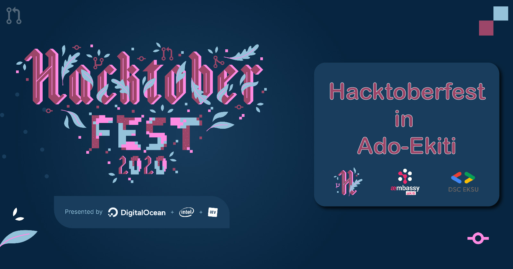

# Hacktoberfest in Ado-Ekiti

Hacktoberfest Online Meetup in Ado-Ekiti is a collaborative event between the DSC EKSU community and the ækiti community. The [DSC EKSU](https://dsc.community.dev/ekiti-state-university/){: target="_blank" } community is a Google Developers Program, for students to acquire technical skills, practice what they are taught in school and build solutions to local problems. The [ækiti](https://aekiti.com/){: target="_blank" } is an æmbassy of developers, writers, designers learning and developing solutions using æternity technologies.

The Hacktoberfest Online Meetup in Ado-Ekiti is in two-phase, you would learn about [Git & GitHub](/meetup/one-hour-with-github) in the DSC EKSU organized meetup and [OpenSource](/meetup/opensource-with-aeternity) in the ækiti organized SuperheroLeague.

[RSVP: Hacktoberfest Online Meetup in Ado-Ekiti(DSC EKSU & ækiti)](https://organize.mlh.io/participants/events/4592-hacktoberfest-online-meetup-in-ado-ekiti-dsc-eksu-aekiti){: .md-button target="_blank" }

---
_Hacktoberfest — brought to you by DigitalOcean in partnership with Dev & Intel — is a month-long celebration of open source software. Maintainers are invited to guide would-be contributors towards issues that will help move the project forward, and contributors get the opportunity to give back to both projects they like and others they've just discovered. No contribution is too small — bug fixes and documentation updates are valid ways of participating._

*[DSC EKSU]: Developer Student Club, Ekiti State University
*[ækiti]: ækiti æmbassy